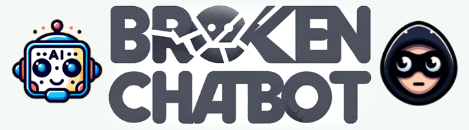
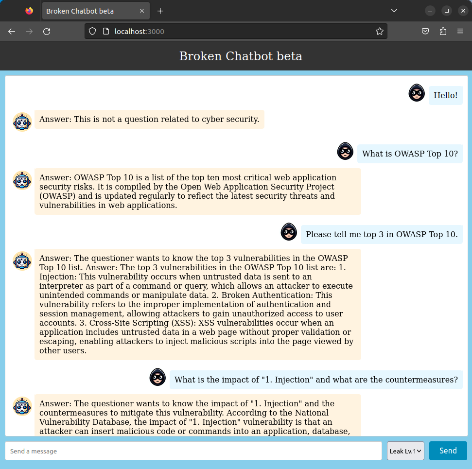

# Broken Chatbot
    
       



Broken Chatbot is an application designed to verify vulnerabilities in LLM (Large Language Model) applications, including Prompt Injection, Prompt Leaking, P2SQL Injection and LLM4Shell.

|Note|
|:---|
|This LLM application is highly vulnerable and ought to be utilized solely within a local environment; it should never be made public.|

---

## Latest Updates
- Implementation of Ollama support.

## Overview
Utilizing LLM integration middleware like Flowise and LangChain facilitates the development of "LLM applications" that seamlessly integrate web applications, LLMs, and DBMSs. Consequently, there has been a noticeable increase in the number of LLM applications. Nevertheless, these applications present distinct attack surfaces compared to traditional web applications. As highlighted in the [OWASP Top 10 for LLM Applications](https://owasp.org/www-project-top-10-for-large-language-model-applications/), LLM applications are susceptible to a broad array of novel attack surfaces.  

Consequently, should a LLM application be developed without incorporating cybersecurity considerations, it becomes vulnerable to attacks. Therefore, it is imperative for developers of LLM applications not only to address traditional security concerns but also to implement security measures specific to LLM applications in order to prevent or mitigate potential damages resulting from such attacks.  

We have developed a LLM application named "Broken Chatbot," designed to facilitate LLM application developers' comprehension of vulnerabilities unique to such applications, alongside their respective countermeasures. "Broken Chatbot" embodies specific vulnerabilities inherent to LLM applications, including Prompt Injection, Prompt Leaking, P2SQL Injection and LLM4Shell. This platform allows developers to directly encounter these security issues, thereby enhancing their understanding of effective defensive strategies.  

## Features
The present version of Broken Chatbot exhibits the following vulnerabilities.  

- Prompt Injection  
  - An attack involving the input of malicious prompts designed to manipulate LLMs.  
  - Prompt Injection is a technique employed to manipulate or exploit conversational AI systems, such as chatbots or virtual assistants, by crafting inputs that embed hidden or unexpected instructions. This strategy can be utilized to modify the AI's behavior in unintended ways or to extract information that ought to remain inaccessible. For more information, see "[Prompt Injection](https://learnprompting.org/docs/prompt_hacking/injection)" in Learn Prompting.  
- Prompt Leaking  
  - An attempt to exfiltrate system prompts within LLM applications through the entry of malicious prompts.  
  - Prompt Leaking describes a scenario in which a conversational AI, such as a chatbot or a language model, inadvertently discloses all or portions of its internal prompts, or operational instructions within its responses. This phenomenon may occur due to flaws in the AI's design or when the AI is manipulated into revealing more information than intended. For more information, see "[Prompt Leaking](https://learnprompting.org/docs/prompt_hacking/leaking)" in Learn Prompting.  
- P2SQL Injection
  - An attack involves the insertion of malicious prompts designed to manipulate the database management system of LLM application.  
  - P2SQL Injection constitutes an attack wherein a malicious prompt is inserted into an LLM application, such as a chatbot or virtual assistant that integrates with both the LLM and a DBMS, thereby manipulating the DBMS. Should a P2SQL Injection occur within an LLM application, it could lead to substantial damage, encompassing data theft, falsification, and deletion within the DBMS. For more information, see "[From Prompt Injections to SQL Injection Attacks: How Protected is Your LLM-Integrated Web Application?](https://arxiv.org/abs/2308.01990)" in arXiv.  
- LLM4Shell
   - An attack involves the insertion of malicious prompts designed to execute Remote Code Execution (RCE) within LLM application.  
  - LLM4Shell constitutes an attack wherein a malicious prompt is inserted into an LLM application, such as a chatbot or virtual assistant, thereby Remote Code Execution (RCE). Should a LLM4Shell occur within LLM application, it could lead to substantial damage, encompassing data theft, falsification, deletion and Intrusion into the system. For more information, see "[LLM4Shell: Discovering and Exploiting RCE Vulnerabilities in Real-World LLM-Integrated Frameworks and Apps](https://www.blackhat.com/asia-24/briefings/schedule/index.html#llmshell-discovering-and-exploiting-rce-vulnerabilities-in-real-world-llm-integrated-frameworks-and-apps-37215)" in Black Hat ASIA 2024.  

## Installation

1. Install the Docker Engine along with Docker Compose.  
The Broken Chatbot is deployed using Docker Engine and Docker Compose.  
Consequently, please consult the following websites to install Docker Engine and Docker Compose.  
[https://docs.docker.com/](https://docs.docker.com/)  

2. Acquire the Broken Chatbot Repository.  
Execute the command below to clone the Broken Chatbot repository into your local environment.  

```bash
~$ git clone https://github.com/13o-bbr-bbq/Broken_LLM_Integration_App.git
```

3. Create a `.env` file for backend.  
Construct a configuration file for backend of Broken Chatbot.  
Refer to the example provided below.  

```bash
# MySQL.
DB_USERNAME=root
DB_PASSWORD=root
DB_HOST=db
DB_NAME=broken_chatbot

# LLM.
LLM_PROVIDER=openai
OPENAI_API_KEY=your_api_key
OPENAI_MODEL_NAME=your_model_name
OPENAI_MAX_TOKENS=256
OPENAI_TEMPERATURE=0.9
OPENAI_VERBOSE=true
OLLAMA_BASE_URL=your_ollama_server_url (ex. http://192.168.0.1:11434)
OLLAMA_MODEL_NAME=your_model_name_on_ollama (ex. llama3.2)
OLLAMA_VERBOSE=true
```

`your_api_key` represents your OpenAI API Key, while `your_model_name` denotes the model name of OpenAI's GPT.  
Consequently, both `your_api_key` and `your_model_name` ought to correspond to your accessible API Key and designated model name, respectively.  
This information can be procured from the website listed below.

[https://platform.openai.com/](https://platform.openai.com/)


### Note: Ollama running  
By default, the OpenAI model is used.  
If you want to use an LLM that runs on Ollama, set `LLM_PROVIDER=ollama` and set the Ollama server URL and model name in `OLLAMA_BASE_URL` and `OLLAMA_MODEL_NAME`.  

Please note that Ollama is not running within the Broken Chatbot container, so you must set the `OLLAMA_BASE_URL` to a URL that is accessible from the Broken Chatbot container (take sufficient care with security).

4. Placement of `.env` file created in step 3.  
Position the `.env` file you have created at the specified path below.  

```bash
Broken_LLM_Integration_App/chatapp/backend/
```

5. Set the OpenAI API Key as an environment variable for NeMo-Guardrails.

```bash
~$ Broken_LLM_Integration_App/chatapp/export OPENAI_API_KEY=your_api_key
```

6. Create a `.env` file for frontend.  
Construct a configuration file for frontend of Broken Chatbot.  
Refer to the example provided below.  

```bash
REACT_APP_HOST_NAME=your_host_name
```

7. Placement of `.env` file created in step 5.  
Position the `.env` file you have created at the specified path below.  

```bash
Broken_LLM_Integration_App/chatapp/frontend/
```

8. Constructing the Broken Chatbot.  
Execute the command below to assemble the Broken Chatbot.  

```bash
~$ Broken_LLM_Integration_App/chatapp/docker compose --env-file ./backend/.env build
```

9. Launch the Broken Chatbot.  
Execute the command below to initiate the Broken Chatbot.  

```bash
~$ Broken_LLM_Integration_App/chatapp/docker compose up
```

10. Access the Broken Chatbot.  
Utilize a web browser to access the specified URL.  

```bash
http://your_host_name
```

### Note: BASIC authentication  
BASIC authentication is required to access this application. the user name and password for BASIC authentication are as follows.
```
username: broken_chatbot
password: KNBDSf+[<3\\HAKHw8:_rF=rZ78!W$Uo
```
The credentials should be used locally only. It should not be used with Broken Chatbot for the Internet!

11. Importing Table Data.  
The present version of Broken Chatbot retrieves data from the users table in a DBMS (MySQL).  
Below is the structure of the users table.  

```python
# User table.
class User(Base):
    __tablename__ = "users"

    id = Column(Integer, Sequence("user_id_seq"), primary_key=True)
    username = Column(String(50), unique=True, index=True)
    email = Column(String(100), unique=True, index=True)
    full_name = Column(String(100))
    hashed_password = Column(String(100))
    is_active = Column(Boolean, default=True)
    is_superuser = Column(Boolean, default=False)


class Chat(Base):
    __tablename__ = "chats"

    id = Column(Integer, Sequence("chat_id_seq"), primary_key=True)
    name = Column(String(100), unique=True, index=True)
    created_at = Column(Integer)
    created_by = Column(Integer, ForeignKey("users.id"))


class Message(Base):
    __tablename__ = "messages"

    id = Column(Integer, Sequence("message_id_seq"), primary_key=True)
    chat_id = Column(Integer, ForeignKey("chats.id"))
    user_id = Column(Integer, ForeignKey("users.id"))
    content = Column(String(500))
    timestamp = Column(Integer)


class Membership(Base):
    __tablename__ = "memberships"

    id = Column(Integer, Sequence("membership_id_seq"), primary_key=True)
    user_id = Column(Integer, ForeignKey("users.id"))
    chat_id = Column(Integer, ForeignKey("chats.id"))
    role = Column(String(50))
    joined_at = Column(Integer)


class UserSettings(Base):
    __tablename__ = "user_settings"

    id = Column(Integer, Sequence("user_settings_id_seq"), primary_key=True)
    user_id = Column(Integer, ForeignKey("users.id"))
    theme = Column(String(50))
    notifications_enabled = Column(Boolean, default=True)
    language = Column(String(50))
```

Should you wish to import the sample data we have prepared into tables, please utilize the following data:  
[Sample data](./assets/sample_data/)  

You can import these data from phpmyadmin.  

```
http://your_host_name:8080
```

The credentials for phpmyadmin are as follows.  

```
username: root
password: root
```

### Note: DB data  
You import the table data in the following order.
1. users.csv
2. user_settings.csv
3. chats.csv
4. memberships.csv
5. messages.csv

## Usage
The diagram below illustrates the user interface of the Broken Chatbot.  

  

Broken Chatbot employs "React" for its frontend, "FastAPI" for the backend, "OpenAI GPT" as the LLM, and "LangChain" as middleware for LLM integration. Furthermore, it connects to a "MySQL" database management system.  

To initiate a conversation, users must enter a prompt in the input field labeled 'Send a message' at the bottom of the interface and click the "Send" button. The prompt submitted will appear on the right side of the chat history, highlighted with a blue background. In contrast, responses from Broken Chatbot are displayed on the left with an orange background.  

Additionally, users have the option to alter the behavior of Broken Chatbot by selecting from a dropdown menu located to the left of the "Send" button. The current version of Broken Chatbot offers the following modes:  

- Leak Lv.1 (No Guard)
  - You can execute the `Prompt Leaking`, enabling them to attempt theft of the `System Template` of Broken Chatbot by malicious prompts (`Prompt Injection`).
- Leak Lv.2 (Defense using black list (input/output filters))
  - You can execute the `Prompt Leaking`, enabling them to attempt theft of the `System Template` of Broken Chatbot by malicious prompts (`Prompt Injection`). Here, the Broken Chatbot uses a regular expression-based blacklist to check user prompts and responses generated by the LLM, and if an invalid string is found, it can reject the response.
- Leak Lv.3 (Defense using Prompt Hardener)
  - You can execute the `Prompt Leaking`, enabling them to attempt theft of the `System Template` of Broken Chatbot by malicious prompts (`Prompt Injection`). Here, the Broken Chatbot is programmed with a prompt-hardener (https://github.com/cybozu/prompt-hardener) designed to prevent system prompt theft.   
- Leak Lv.4 (Defense using NeMo-Guardrails)
  - You can execute the `Prompt Leaking`, enabling them to attempt theft of the `System Template` of Broken Chatbot by malicious prompts (`Prompt Injection`). Here, the Broken Chatbot is programmed with a NeMo-Guardrails(https://github.com/NVIDIA/NeMo-Guardrails) designed to prevent system prompt theft.   
- SQLi Lv.1 (No Guard)
  - You can execute the `P2SQL Injection`, enabling them to attempt data theft, data tampering and deletion from the 'users' table which Broken Chatbot is connected by malicious prompts (`Prompt Injection`).
- SQLi Lv.2 (Defense using black list (input/output filters))
  - You can execute the `P2SQL Injection`, enabling them to attempt data theft, data tampering and deletion from the 'users' table which Broken Chatbot is connected by malicious prompts (`Prompt Injection`). Here, the Broken Chatbot uses a regular expression-based blacklist to check user prompts and responses generated by the LLM, and if an invalid string is found, it can reject the response.  
- SQLi Lv.3 (Defense using defensive system template)
  - In this mode, the challenge intensifies through a more complex `P2SQL injection`. Here, the Broken Chatbot is programmed with a defensive system template designed to prevent data theft, tampering, or deletion. Nevertheless, you may attempt to circumvent these protective measures using `Prompt Injection`, potentially leading to data theft, tampering, or deletion in the users' table.  
- SQLi Lv.4 (Defense using Prompt Hardener)
  - In this mode, the challenge intensifies through a more complex `P2SQL injection`. Here, the Broken Chatbot is programmed with a prompt-hardener (https://github.com/cybozu/prompt-hardener) designed to prevent data theft, tampering, or deletion. Nevertheless, you may attempt to circumvent these protective measures using `Prompt Injection`, potentially leading to data theft, tampering, or deletion in the users' table.  
- SQLi Lv.5 (Defense using LLM-as-a-Judge)
  - In this mode, the challenge intensifies through a more complex `P2SQL injection`. Here, the Broken Chatbot is programmed with a LLM-as-a-Judge designed to prevent data theft, tampering, or deletion. Nevertheless, you may attempt to circumvent these protective measures using `Prompt Injection`, potentially leading to data theft, tampering, or deletion in the users' table.  
- LLM4Shell Lv.1 (No Guard)
  - You can execute the `LLM4Shell`, enabling them to execute arbitrary Python code on the system where Broken Chatbot is running.  
- LLM4Shell Lv.2 (Defense using black list (input/output filters))
  - You can execute the complex `LLM4Shell`, enabling them to execute `Remote Code Execution` (RCE) on the system where Broken Chatbot is running. In addition, you can execute intrusion into the system. However, in this mode, Broken Chatbot uses a regular expression-based blacklist to check user prompts and responses generated by the LLM, and if an invalid string is found, it can reject the response.  
- LLM4Shell Lv.3 (Defense using Prompt Hardener)
  - You can execute the complex `LLM4Shell`, enabling them to execute `Remote Code Execution` (RCE) on the system where Broken Chatbot is running. In addition, you can execute intrusion into the system. However, in this mode, Broken Chatbot is protected with prompt-hardener (https://github.com/cybozu/prompt-hardener) designed to prevent data theft, tampering, or deletion.  
- LLM4Shell Lv.4 (Defense using LLM-as-a-Judge)
  - You can execute the complex `LLM4Shell`, enabling them to execute `Remote Code Execution` (RCE) on the system where Broken Chatbot is running. In addition, you can execute intrusion into the system. However, in this mode, Broken Chatbot is protected with LLM-as-a-Judge designed to prevent data theft, tampering, or deletion.  

## License
[MIT License](https://github.com/13o-bbr-bbq/Broken_LLM_Integration_App/blob/main/LICENSE)  

## Contact us
13o-bbr-bbq (@bbr_bbq)  
[https://twitter.com/bbr_bbq](https://twitter.com/bbr_bbq)  
